# spring-gumball ci/cd example

## Screenshots

### Part 1
#### Java CI with Gradle action Part 1/3
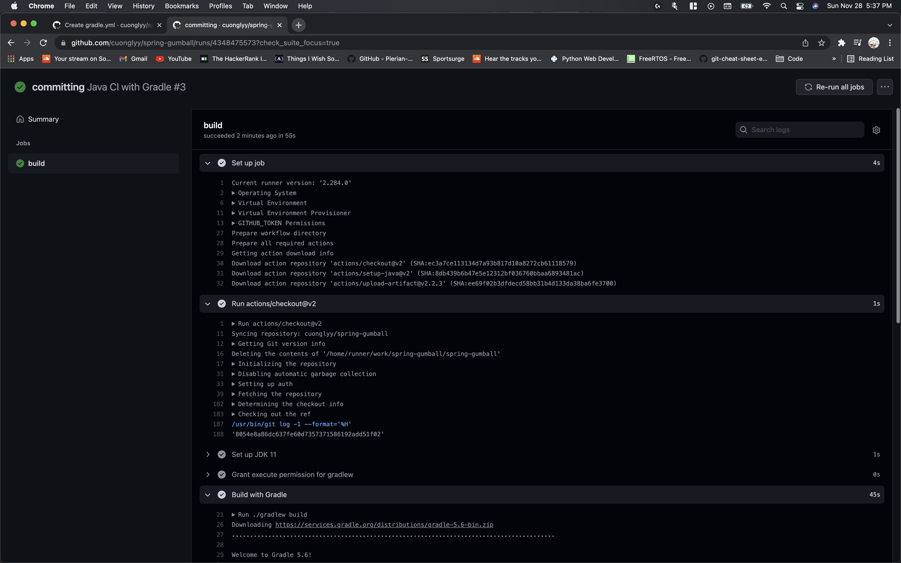  

#### Java CI with Gradle action Part 2/3
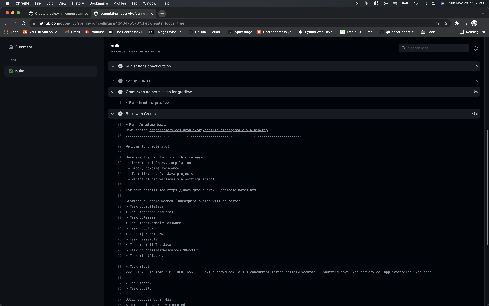

#### Java CI with Gradle action Part 3/3
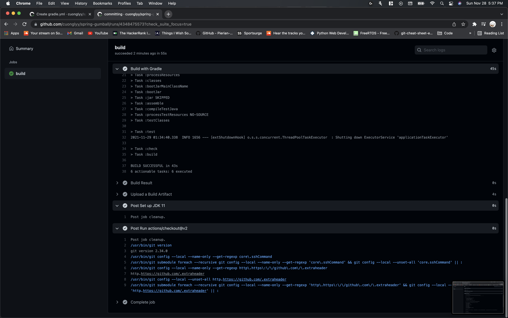

### Part 2
#### GCP Service Account & JSON SA Key
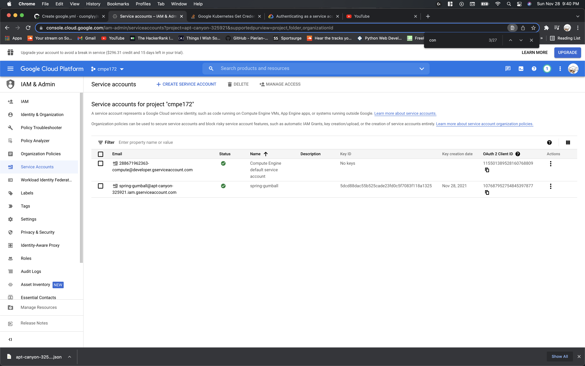

#### SA Key
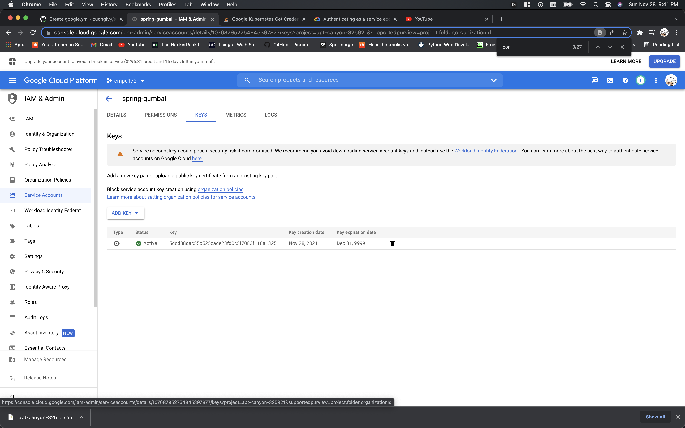  

#### GitHub Action Secrets
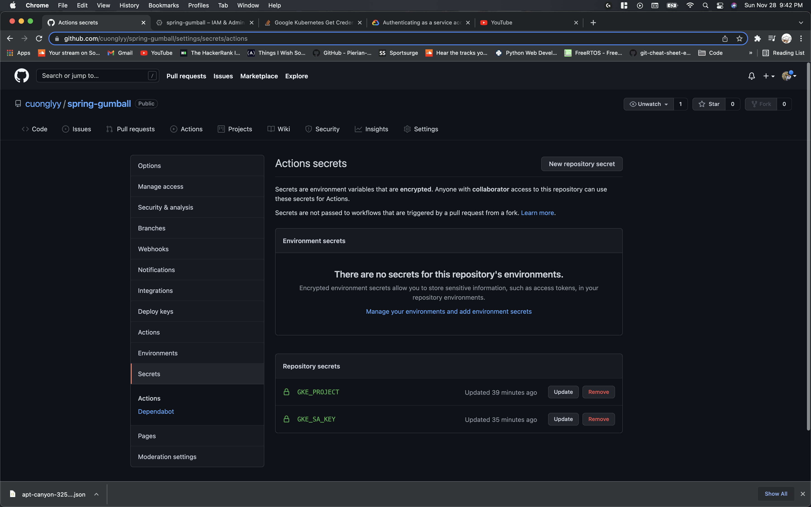

#### GCP Kubernetes Cluster
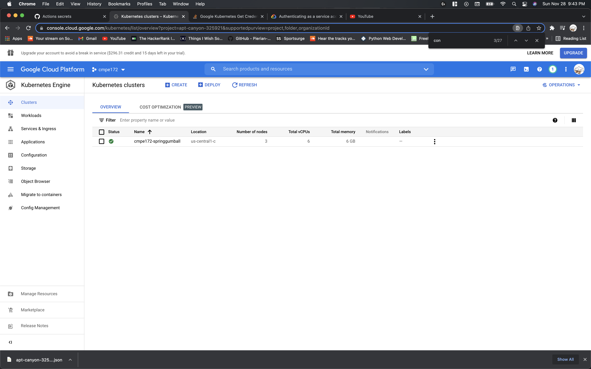

#### GitHub Repo Releases
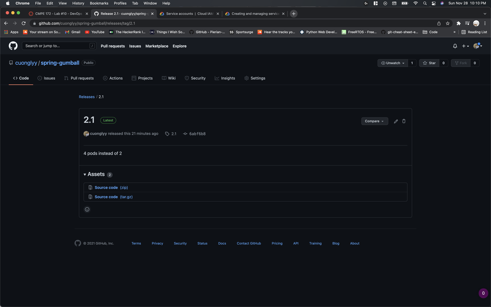

#### CD Deployment workflow
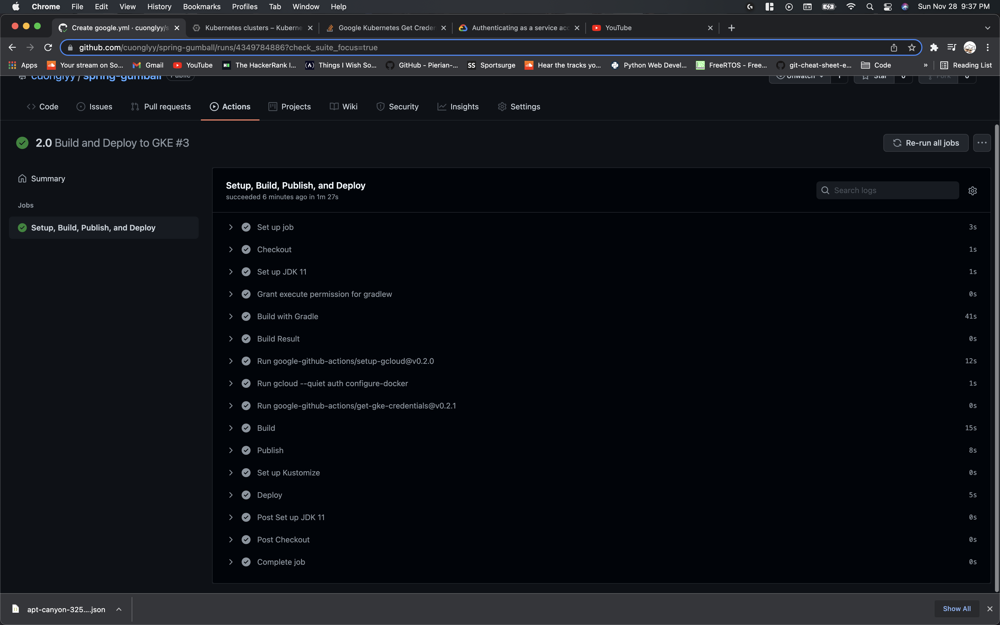  

#### GCP Kubernetes Workload
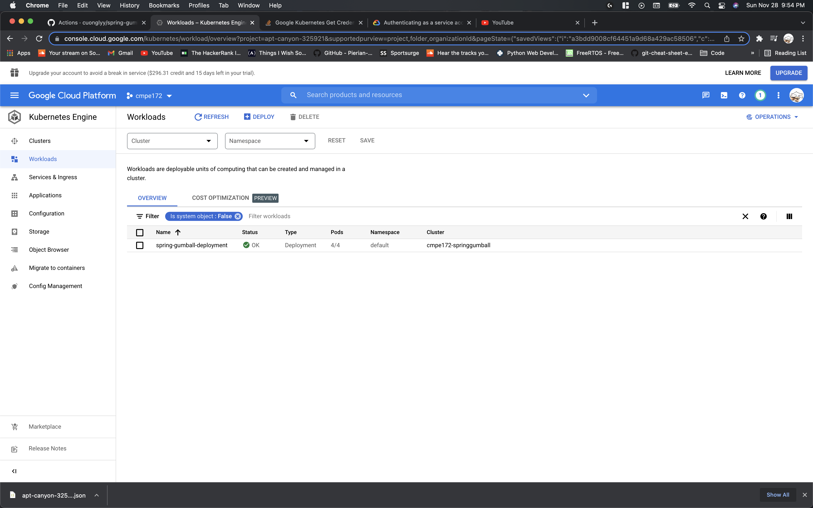  

#### GCP Kubernetes Services
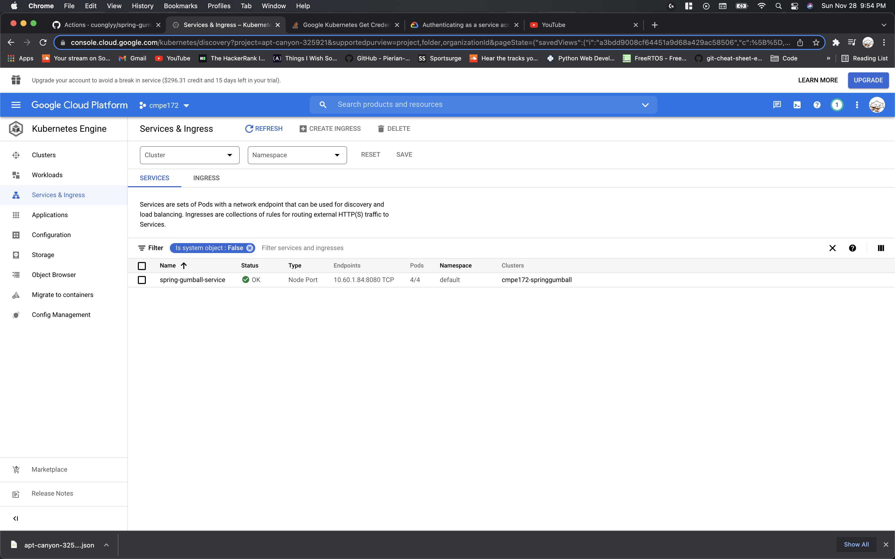   

#### GCP Kubernetes Ingress
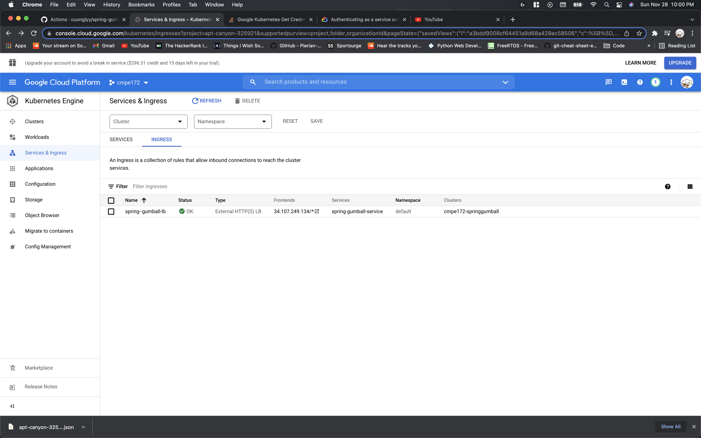   

#### Spring Gumball
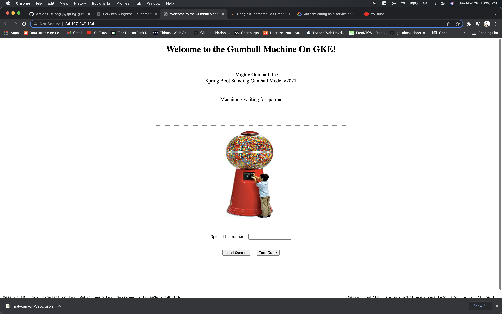